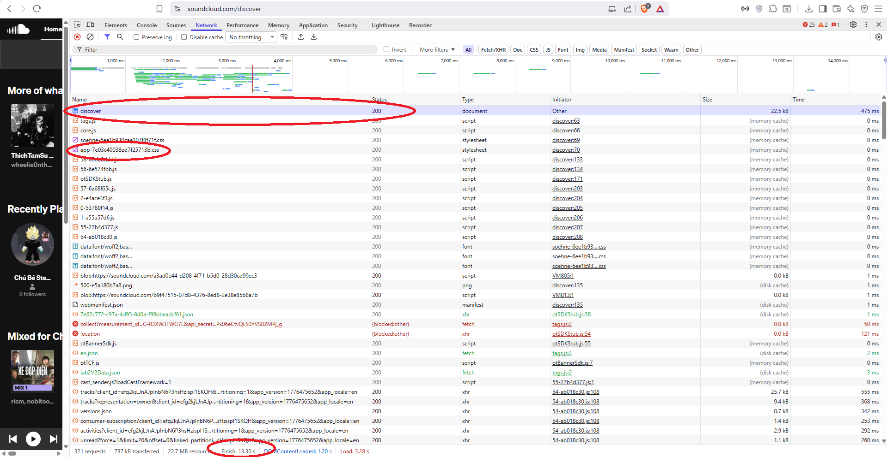

# PHIẾU BÀI TẬP 01

## Câu A1 (5đ) — HTTP & Browser

**Nguồn tham chiếu:**
`tuan_1_html5/01_introduction_html_universe.md`:
- Cuộc Hành Trình 0.3 Giây Xuyên Đại Dương
- 1.1. Kiến trúc Client-Server — "Nhà hàng Online"
- 1.2. HTTP — Ngôn ngữ để Client và Server hiểu nhau
- 1.3. Browser Rendering — Từ Code thành Hình ảnh

**Phần 1:**
Khi gõ `https://shopee.vn` vào trình duyệt:
1. **DNS Lookup:**
   - Trình duyệt tra cứu DNS để chuyển đổi từ tên miền thành IP của server.
2. **Gửi HTTP Req (GET):**
   - Client (trình duyệt) gửi HTTP GET request đến server Shopee.
   - Request đi qua: Laptop -> router WiFi -> nhà mạng -> Internet -> đến server.
3. **Server xử lý Req:**
   - Server Shopee nhận request và xử lý.
   - Tương tự như: "Bếp nấu phở" - server chuẩn bị dữ liệu, truy vấn CSDL.
4. **Server trả HTTP Res:**
   - Server trả về HTTP Response với status code (thường là 200 nếu thành công).
   - Res chứa file HTML, CSS, JS và các tài nguyên khác.
5. **Trình duyệt nhận HTML, CSS, JS và các tài nguyên khác:**
   - Trình duyệt đọc file HTML đầu tiên.
   - Parse HTML và phát hiện cần tải thêm tài nguyên (CSS, JS, images, fonts...).
   - Gửi thêm nhiều requests (theo tài liệu: "khoảng 50-100 requests").
6. **Browser Rendering:**
   - Theo tài liệu section "1.3. Browser Rendering":
     - Parse HTML -> Đọc bản vẽ kiến trúc (tạo DOM tree - cấu trúc trang).
     - Parse CSS -> Đọc bản thiết kế nội thất (tạo CSSOM tree - màu sắc, font, layout).
     - Execute JS -> Lắp hệ thống điện, nước (chạy code tương tác, animation).
     - Paint & Render -> Hoàn thiện, giao nhà cho chủ (hiển thị lên màn hình).

-> **Kết quả:** Người dùng thấy giao diện trang web Shopee hiện lên trên màn hình.

**Phần 2:**

---

## Câu A2 (5đ) — Semantic HTML

**Nguồn tham chiếu:**
`tuan_1_html5/04_visible_part_html.md`:
- Tại sao không dùng `
` cho mọi thứ?

**Những lỗi Semantics:**
- **Lỗi 1:** Dùng `
` thay vì `<header>`.
  - **Lý do sai:** `<header>` là thẻ semantic dành cho phần đầu trang.
  - **Sửa:** Thay bằng `<header>`.
- **Lỗi 2:** Dùng `
` thay vì `<nav>`.
  - **Lý do sai:** Menu điều hướng cần dùng `<nav>` để Google và Screen Reader hiểu.
  - **Sửa:** Thay bằng `<nav>`.
- **Lỗi 3:** Dùng `
` thay vì `<main>`.
  - **Lý do sai:** Nội dung chính cần thẻ `<main>` cho SEO.
  - **Sửa:** Thay bằng `<main>`.
- **Lỗi 4:** Dùng `
` thay vì `<article>`.
  - **Lý do sai:** Mỗi sản phẩm là nội dung độc lập, cần dùng `<article>`.
  - **Sửa:** Thay bằng `<article>`.
- **Lỗi 5:** `` thiếu thuộc tính `alt`.
  - **Lý do sai:** Thiếu `alt` vi phạm accessibility và SEO.
  - **Sửa:** Thêm `alt="mô tả ảnh"`.
- **Lỗi 6:** Dùng `
` thay vì `<h2>`.
  - **Lý do sai:** Tiêu đề cần dùng thẻ heading.
  - **Sửa:** Thay bằng `<h2>iphone 16 pro</h2>`.
- **Lỗi 7:** Dùng `
` thay vì `<footer>`.
  - **Lý do sai:** `<footer>` là thẻ semantic cho phần cuối trang.
  - **Sửa:** Thay bằng `<footer>`.

---

## Câu A3 (5đ) — Block vs Inline

**Nguồn tham chiếu:**
`tuan_1_html5/04_visible_part_html.md`:
- Block vs Inline — Hai loại element cơ bản

---

## Câu A4 (5đ) — Table

**Nguồn tham chiếu:**
`tuan_1_html5/05_tables_hyperlinks.md`

**Cấu trúc phân lớp của bảng trong HTML:**
- `<thead>` **(Phần đầu):** Dành riêng cho các hàng tiêu đề, đóng vai trò như nhãn dán giúp xác định nội dung của từng cột bên dưới.
- `<tbody>` **(Phần thân):** Khu vực chứa dữ liệu cốt lõi. Trong một bảng, bạn hoàn toàn có thể phân nhóm thông tin bằng cách sử dụng nhiều thẻ `<tbody>` khác nhau.
- `<tfoot>` **(Phần chân):** Vị trí chốt lại vấn đề ở cuối bảng, rất lý tưởng để hiển thị các số liệu tổng hợp, kết quả tính toán hoặc các ghi chú bổ sung.

**Tại sao "Tuyệt đối không" dùng thẻ Table để dàn bố cục (Layout) website?**
- **Thiếu sự linh hoạt (Responsive kém):** Bản chất của bảng là một khối cứng nhắc. Cấu trúc ô tự động phình ra theo nội dung khiến việc tùy biến giao diện trên nhiều kích thước màn hình bằng CSS trở thành một "cơn ác mộng".
- **Bảo trì khó khăn & Nặng máy:** Để tạo layout bằng bảng, bạn phải lồng ghép vô số thẻ vào nhau tạo ra một mớ code HTML lộn xộn. Việc thêm/bớt các cột dễ làm vỡ toàn bộ cấu trúc, đồng thời trình duyệt cũng phải tốn nhiều tài nguyên hơn để tính toán và tải lại giao diện.
- **Chống chỉ định cho SEO & Accessibility:** Các phần mềm hỗ trợ người khiếm thị (Screen Reader) luôn quét dữ liệu một cách máy móc theo từng ô trong hàng. Nếu bạn dùng bảng làm layout, dòng chảy nội dung sẽ bị băm vụn và đọc sai hoàn toàn so với logic thông tin ban đầu.