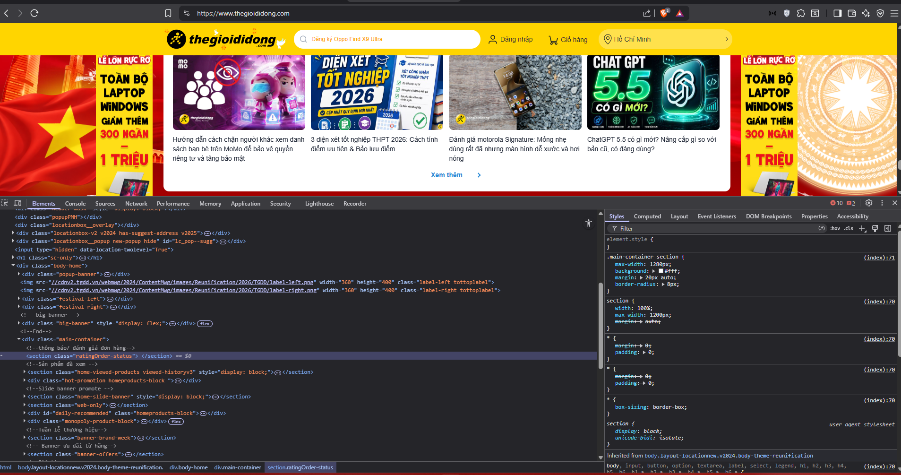
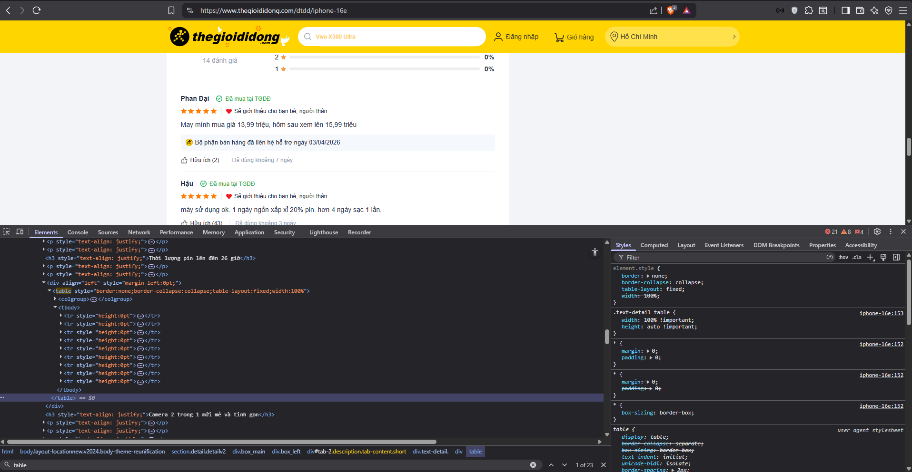
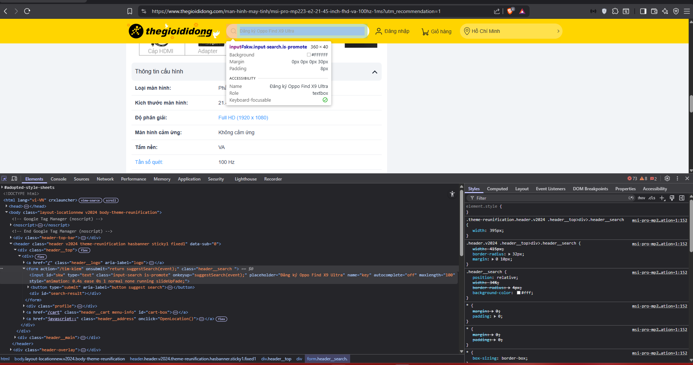

# PHIẾU BÀI TẬP 01

## PHẦN A — KIỂM TRA ĐỌC HIỂU (20 điểm)

## Câu A1 (5đ) — HTTP & Browser

**Nguồn tham chiếu:**
`tuan_1_html5/01_introduction_html_universe.md`:
- Cuộc Hành Trình 0.3 Giây Xuyên Đại Dương
- 1.1. Kiến trúc Client-Server — "Nhà hàng Online"
- 1.2. HTTP — Ngôn ngữ để Client và Server hiểu nhau
- 1.3. Browser Rendering — Từ Code thành Hình ảnh

**Phần 1:**
Khi gõ `https://shopee.vn` vào trình duyệt:
1. **DNS Lookup:**
   - Trình duyệt tra cứu DNS để chuyển đổi từ tên miền thành IP của server.
2. **Gửi HTTP Req (GET):**
   - Client (trình duyệt) gửi HTTP GET request đến server Shopee.
   - Request đi qua: Laptop -> router WiFi -> nhà mạng -> Internet -> đến server.
3. **Server xử lý Req:**
   - Server Shopee nhận request và xử lý.
   - Tương tự như: "Bếp nấu phở" - server chuẩn bị dữ liệu, truy vấn CSDL.
4. **Server trả HTTP Res:**
   - Server trả về HTTP Response với status code (thường là 200 nếu thành công).
   - Res chứa file HTML, CSS, JS và các tài nguyên khác.
5. **Trình duyệt nhận HTML, CSS, JS và các tài nguyên khác:**
   - Trình duyệt đọc file HTML đầu tiên.
   - Parse HTML và phát hiện cần tải thêm tài nguyên (CSS, JS, images, fonts...).
   - Gửi thêm nhiều requests (theo tài liệu: "khoảng 50-100 requests").
6. **Browser Rendering:**
   - Theo tài liệu section "1.3. Browser Rendering":
     - Parse HTML -> Đọc bản vẽ kiến trúc (tạo DOM tree - cấu trúc trang).
     - Parse CSS -> Đọc bản thiết kế nội thất (tạo CSSOM tree - màu sắc, font, layout).
     - Execute JS -> Lắp hệ thống điện, nước (chạy code tương tác, animation).
     - Paint & Render -> Hoàn thiện, giao nhà cho chủ (hiển thị lên màn hình).

-> **Kết quả:** Người dùng thấy giao diện trang web Shopee hiện lên trên màn hình.

**Phần 2:**

---

## Câu A2 (5đ) — Semantic HTML

**Nguồn tham chiếu:**
`tuan_1_html5/04_visible_part_html.md`:
- Tại sao không dùng `
` cho mọi thứ?

**Những lỗi Semantics:**
- **Lỗi 1:** Dùng `
` thay vì `<header>`.
  - **Lý do sai:** `<header>` là thẻ semantic dành cho phần đầu trang.
  - **Sửa:** Thay bằng `<header>`.
- **Lỗi 2:** Dùng `
` thay vì `<nav>`.
  - **Lý do sai:** Menu điều hướng cần dùng `<nav>` để Google và Screen Reader hiểu.
  - **Sửa:** Thay bằng `<nav>`.
- **Lỗi 3:** Dùng `
` thay vì `<main>`.
  - **Lý do sai:** Nội dung chính cần thẻ `<main>` cho SEO.
  - **Sửa:** Thay bằng `<main>`.
- **Lỗi 4:** Dùng `
` thay vì `<article>`.
  - **Lý do sai:** Mỗi sản phẩm là nội dung độc lập, cần dùng `<article>`.
  - **Sửa:** Thay bằng `<article>`.
- **Lỗi 5:** `` thiếu thuộc tính `alt`.
  - **Lý do sai:** Thiếu `alt` vi phạm accessibility và SEO.
  - **Sửa:** Thêm `alt="mô tả ảnh"`.
- **Lỗi 6:** Dùng `
` thay vì `<h2>`.
  - **Lý do sai:** Tiêu đề cần dùng thẻ heading.
  - **Sửa:** Thay bằng `<h2>iphone 16 pro</h2>`.
- **Lỗi 7:** Dùng `
` thay vì `<footer>`.
  - **Lý do sai:** `<footer>` là thẻ semantic cho phần cuối trang.
  - **Sửa:** Thay bằng `<footer>`.

---

## Câu A3 (5đ) — Block vs Inline

**Nguồn tham chiếu:**
`tuan_1_html5/04_visible_part_html.md`:
- Block vs Inline — Hai loại element cơ bản

---

## Câu A4 (5đ) — Table

**Nguồn tham chiếu:**
`tuan_1_html5/05_tables_hyperlinks.md`

**Cấu trúc phân lớp của bảng trong HTML:**
- `<thead>` **(Phần đầu):** Dành riêng cho các hàng tiêu đề, đóng vai trò như nhãn dán giúp xác định nội dung của từng cột bên dưới.
- `<tbody>` **(Phần thân):** Khu vực chứa dữ liệu cốt lõi. Trong một bảng, bạn hoàn toàn có thể phân nhóm thông tin bằng cách sử dụng nhiều thẻ `<tbody>` khác nhau.
- `<tfoot>` **(Phần chân):** Vị trí chốt lại vấn đề ở cuối bảng, rất lý tưởng để hiển thị các số liệu tổng hợp, kết quả tính toán hoặc các ghi chú bổ sung.

**Tại sao "Tuyệt đối không" dùng thẻ Table để dàn bố cục (Layout) website?**
- **Thiếu sự linh hoạt (Responsive kém):** Bản chất của bảng là một khối cứng nhắc. Cấu trúc ô tự động phình ra theo nội dung khiến việc tùy biến giao diện trên nhiều kích thước màn hình bằng CSS trở thành một "cơn ác mộng".
- **Bảo trì khó khăn & Nặng máy:** Để tạo layout bằng bảng, bạn phải lồng ghép vô số thẻ vào nhau tạo ra một mớ code HTML lộn xộn. Việc thêm/bớt các cột dễ làm vỡ toàn bộ cấu trúc, đồng thời trình duyệt cũng phải tốn nhiều tài nguyên hơn để tính toán và tải lại giao diện.
- **Chống chỉ định cho SEO & Accessibility:** Các phần mềm hỗ trợ người khiếm thị (Screen Reader) luôn quét dữ liệu một cách máy móc theo từng ô trong hàng. Nếu bạn dùng bảng làm layout, dòng chảy nội dung sẽ bị băm vụn và đọc sai hoàn toàn so với logic thông tin ban đầu.

## PHẦN B — THỰC HÀNH CODE (60 điểm)

## Bài B3 (15đ) — Debug HTML

* **Lỗi 1:** Dòng 1 — Sai cú pháp khai báo DOCTYPE — Sửa `<!DOCTYPE>` thành `<!DOCTYPE html>`.
* **Lỗi 2:** Dòng 2 — Thiếu thẻ đóng `</title>` — Thêm `</title>` vào cuối dòng.
* **Lỗi 3:** Dòng 3 — Sai giá trị thuộc tính charset — Sửa `"utf8"` thành `"utf-8"`.
* **Lỗi 4:** Dòng 4 — Thẻ đóng tiêu đề sai cú pháp — Sửa thẻ `<h1>` ở cuối câu thành `</h1>`.
* **Lỗi 5:** Dòng 4 & 6 — Lỗi Semantic: Thẻ `<h1>` đại diện cho tiêu đề chính nhưng lại đặt lơ lửng bên ngoài thẻ `<header>` — Cách sửa: Di chuyển toàn bộ dòng 4 vào bên trong thẻ `<header>`.
* **Lỗi 6:** Dòng 8 — Thẻ đóng liên kết sai cú pháp — Sửa thẻ `<a>` ở cuối dòng thành `</a>`.
* **Lỗi 7:** Dòng 16 — Lỗi Syntax & Semantic: Thuộc tính `src` thiếu dấu ngoặc kép chứa đường dẫn, đồng thời thiếu thuộc tính `alt` (bắt buộc để đảm bảo Accessibility) — Sửa thành ``.
* **Lỗi 8:** Dòng 18 — Lỗi lồng thẻ (nesting) sai thứ tự — Mở `<b>` sau thẻ `
` thì phải đóng `</b>` trước `
`. Đồng thời, về mặt Semantic, nên dùng `<strong>` thay cho `<b>` để nhấn mạnh giá tiền. Sửa thành `<strong>25.990.000đ</strong>
`.
* **Lỗi 9:** Dòng 25 & 26 — Lỗi Semantic: Dòng tiêu đề của bảng lại đi dùng thẻ dữ liệu bình thường `<td>` — Cách sửa: Đổi `<td>` thành thẻ tiêu đề bảng `<th>`. (Nên lồng thêm `<thead>` và `<tbody>` để bảng chuẩn cấu trúc).
* **Lỗi 10:** Dòng 36 — Lỗi Semantic: Theo chuẩn HTML5, mỗi trang web chỉ được phép có MỘT thẻ `<main>` duy nhất. Nội dung của thanh bên (sidebar) phải được đặt trong thẻ `<aside>` — Cách sửa: Thay thẻ `<main>` thứ hai thành `<aside>`.
* **Lỗi 11:** Dòng 41 — Thiếu thẻ đóng đoạn văn — Thêm `
` vào cuối dòng.

## Bài B4 (15đ) — Phân tích trang web thật
### 1. Phân tích thẻ Semantic HTML5 trên trang chủ

* **Trang web được chọn:** thegioididong.com

**3 thẻ semantic HTML5 trang đang sử dụng:**

- **Thẻ `<header>`:**  
  Nằm ở đầu trang (`<header class="header...">`), dùng để bao phần đầu website.  
  Chứa logo, thanh tìm kiếm, menu điều hướng và giỏ hàng - đúng chức năng semantic của thẻ `<header>`.

- **Thẻ `<section>`:**  
  Được dùng để chia trang thành các khu vực nội dung riêng biệt thay vì lạm dụng `
`.  
  Ví dụ:
  - `<section class="home-viewed-products...">` - khu sản phẩm đã xem  
  - `<section class="search-trend">` - khu xu hướng tìm kiếm  

- **Thẻ `<footer>`:**  
  Nằm cuối trang (`<footer class="footer...">`), chứa thông tin hotline, địa chỉ công ty, bản quyền và liên kết phụ trợ.

---

**2 thẻ trang chưa dùng đúng chuẩn semantic:**

- **Lỗi 1:** Dùng `
` làm khung nội dung chính thay vì `<main>`.  
  - **Lý do sai:** Theo chuẩn HTML5, khu vực nội dung chính nên dùng thẻ `<main>`.  
  - **Thực tế:** Trang dùng `
`, `
` để bọc nội dung chính.  
  - **Vấn đề:** Làm giảm semantic, ảnh hưởng SEO và screen reader.  
  - **Sửa:** Thay bằng thẻ `<main>`.

- **Lỗi 2:** Dùng `
` hoặc `
` làm nút bấm thay vì `<button>`.  
  - **Lý do sai:** `<button>` mới là thẻ dành cho hành động bấm.  
  - **Thực tế:** Có chỗ dùng  
    `
` cho nút “Xóa lịch sử”,  
    hoặc `
` để đóng popup.  
  - **Vấn đề:** Sai ngữ nghĩa, ảnh hưởng accessibility.  
  - **Sửa:** Thay bằng thẻ `<button>`.

  ### 2. Thẻ `<table>`

Table này hiển thị thông tin thống kê và so sánh thời lượng pin khi xem video của nhiều thế hệ iPhone, từ iPhone SE 2, iPhone 11 đến các dòng mới như iPhone 16 và iPhone 16e.

Có dùng `<tbody>`

Toàn bộ các hàng dữ liệu `<tr>` trong bảng đều được đặt bên trong thẻ `<tbody>`, dùng để chứa phần nội dung chính của bảng.

Không dùng `<thead>`

Đoạn code không sử dụng thẻ `<thead>`.  
Hàng đầu tiên đóng vai trò tiêu đề bảng gồm:

`Thế hệ điện thoại`  
`Thời gian sử dụng`

nhưng được đặt trực tiếp trong `<tbody>` và dùng thẻ `<td>` thông thường, thay vì dùng cấu trúc semantic chuẩn gồm `<thead>` và `<th>` để định nghĩa tiêu đề cột.

### 3. Thẻ form `<form action="/tim-kiem"...>`

- Thẻ form có thuộc tính `action="/tim-kiem"` dùng để xác định nơi gửi dữ liệu tìm kiếm. Nếu không khai báo `method` thì theo chuẩn HTML5 trình duyệt mặc định sử dụng phương thức GET.

- Trong form này sử dụng hai kiểu `input type`
- `type="text"` nằm ở thẻ `<input id="skw" type="text"...>`

- Giải thích: Đây là trường nhập liệu văn bản một dòng dùng để người dùng nhập từ khóa tìm kiếm. Ô nhập có thuộc tính `placeholder="MacBook Neo"` giúp hiển thị nội dung gợi ý khi chưa nhập dữ liệu.

- `type="submit"` nằm ở thẻ `<button type="submit"...>`

- Giải thích: Đây là nút gửi biểu mẫu, chứa biểu tượng kính lúp tìm kiếm. Khi người dùng nhấn nút, toàn bộ dữ liệu trong form sẽ được gửi đến địa chỉ khai báo trong thuộc tính `action`.

## PHẦN C — SUY LUẬN (20 điểm)
## Câu C1 (10đ) — Thiết kế cấu trúc
[text](C1.html)