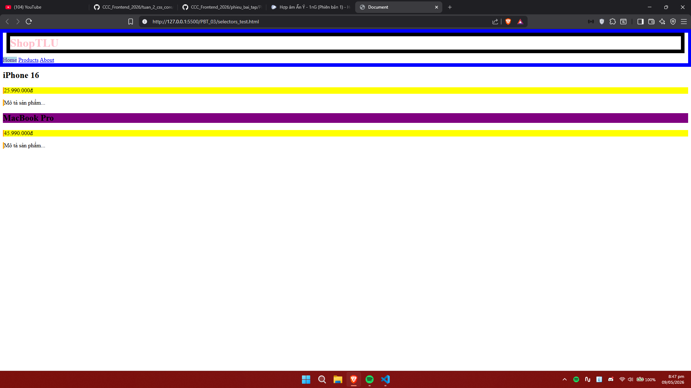

# PHIẾU BÀI TẬP 03
## PHẦN A — KIỂM TRA ĐỌC HIỂU (25 điểm)
### Câu A1 (5đ) — 3 Cách nhúng CSS
1. inline css
- VD: `<h1 style="color: blue; font-size: 40px; text-align: center;">This is a styled heading</h1>`
- Ưu điểm: Nhanh, apply ngay lập tực, không cần tạo file css riêng, ưu tiên cao nhất, tiện cho việc test 1 element cụ thể
- Nhược điểm: Phải copy nhiều lần nếu muốn dùng lại, khó đọc, khó maintain, rối mắt
- Khi nào nên dùng: Debug/Test nhanh, Email HTML, Override Style trong trường hợp đặc biệt

2. internal css (đặt trong thẻ `<style></style>`)
- VD: 
```
<!DOCTYPE html>
<html>
<head>
  <style>
    body {
      background-color: lightblue;
    }
    h1 {
      color: navy;
      margin-left: 20px;
    }
  </style>
</head>
<body>
  <h1>Welcome to Internal CSS</h1>
  <p>Styles defined in the head apply to this entire page.</p>
</body>
</html>
```
- Ưu điểm: Cả HTML và CSS nằm trong 1 file => dễ test, demo ; Không cần tạo file CSS riêng, Sử dụng lại style trong cùng 1 trang, Nhanh
- Nhược điểm: Không dùng lại được ở file HTML khác, file HTML dài và nặng hơn, khó bảo trì
- Khi nào nên dùng: Trang đơn, Landing Page, Email template

3. external css (tạo file css riêng)
- VD: 
- file css: 
```body {
  background-color: lightblue;
}
h1 {
  color: navy;
  margin-left: 20px;
}
```

- file html:
```<!DOCTYPE html>
<html>
<head>
  <link rel="stylesheet" href="styles.css">
</head>
<body>
  <h1>This is a heading</h1>
  <p>This is a paragraph.</p>
</body>
</html>
```
- Ưu điểm: File dễ đọc, dễ bảo trì, dùng được file css cho nhiều trang html khác
- Nhược điểm: Cần HTTP req thêm, phải quản lý nhiều files, cần localhost/server để test
- Khi nào nên dùng: Dự án thực tế, Website nhiều trang, bảo trì lâu dài, làm việc nhóm

### Câu A2 (8đ) — CSS Selectors — Dự đoán kết quả
1. `h1` → Chọn: **ShopTLU**
   - Giải thích: Chọn tất cả thẻ h1 trong trang, ở đây chỉ có 1 thẻ h1

2. `.price` → Chọn: **25.990.000đ** và **45.990.000đ**
   - Giải thích: Chọn tất cả elements có class="price", có 2 thẻ p

3. `#app header` → Chọn: **toàn bộ thẻ <header class="top-bar dark">**
   - Giải thích: Chọn thẻ header nằm trong element có id="app"

4. `nav a:first-child` → Chọn: **Home**
   - Giải thích: Chọn thẻ a đầu tiên trong nav (pseudo-class :first-child)

5. `.product.featured h2` → Chọn: **MacBook Pro**
   - Giải thích: Chọn h2 trong element có CẢ 2 class "product" và "featured"

6. `article > p` → Chọn: **25.990.000đ**, **Mô tả sản phẩm...**, **45.990.000đ**, **Mô tả sản phẩm...**
   - Giải thích: Chọn tất cả thẻ p là con TRỰC TIẾP của article (4 thẻ p)

7. `a[href="/"]` → Chọn: **Home**
   - Giải thích: Chọn thẻ a có thuộc tính href="/" (attribute selector)

8. `.top-bar.dark h1` → Chọn: **ShopTLU**
   - Giải thích: Chọn h1 trong element có CẢ 2 class "top-bar" và "dark"

9. Screenshot: 

### Câu A3 (7đ) — Box Model — Tính toán kích thước

#### trường hợp 1: content-box (mặc định)

```css
.box-1 {
    width: 400px;
    padding: 20px;
    border: 5px solid black;
    margin: 10px;
}
```

**giải thích:**

ở kiểu này, `width` chỉ tính phần nội dung bên trong. còn `padding` và `border` sẽ được cộng thêm vào kích thước thực tế.

**chiều rộng thực tế của box:**

- phần nội dung: 400px  
- khoảng đệm (`padding`): 20px × 2 = 40px  
- đường viền (`border`): 5px × 2 = 10px  

→ tổng chiều rộng:

400 + 40 + 10 = **450px**

**không gian box chiếm trên trang:**

- chiều rộng box: 450px  
- khoảng cách ngoài (`margin`): 10px × 2 = 20px  

→ tổng:

450 + 20 = **470px**

---

#### trường hợp 2: border-box

```css
.box-2 {
    box-sizing: border-box;
    width: 400px;
    padding: 20px;
    border: 5px solid black;
    margin: 10px;
}
```

**giải thích:**

ở kiểu này, `width` đã bao gồm luôn phần nội dung, khoảng đệm và đường viền.

nên khi đặt `width: 400px` thì tổng chiều rộng của box vẫn là 400px.

**chiều rộng thực tế của box:**

→ **400px**

**phần nội dung còn lại:**

- tổng chiều rộng: 400px  
- trừ khoảng đệm: 20px × 2 = 40px  
- trừ đường viền: 5px × 2 = 10px  

→ phần nội dung:

400 - 40 - 10 = **350px**

**không gian box chiếm trên trang:**

- chiều rộng box: 400px  
- khoảng cách ngoài: 10px × 2 = 20px  

→ tổng:

400 + 20 = **420px**

---

#### trường hợp 3: margin collapse

```css
.box-a {
    margin-bottom: 25px;
}

.box-b {
    margin-top: 40px;
}
```

**khoảng cách giữa hai box:**

→ **40px**

**giải thích:**

khi hai `margin` theo chiều dọc chạm nhau thì chúng không cộng lại.

trình duyệt sẽ lấy giá trị lớn hơn.

ở đây:

- `margin-bottom` của box-a là 25px  
- `margin-top` của box-b là 40px  

vì 40 lớn hơn 25 nên khoảng cách cuối cùng là:

→ **40px**

**lưu ý:**

hiện tượng này chỉ xảy ra với:

- khoảng cách trên và dưới (`top`, `bottom`)  
- các phần tử dạng khối  

không xảy ra với khoảng cách trái phải hoặc các phần tử đặc biệt như `absolute` hay `float`.

---

#### trường hợp có margin âm

```css
.box-a {
    margin-bottom: -10px;
}

.box-b {
    margin-top: 40px;
}
```

**khoảng cách giữa hai box:**

→ **30px**

**giải thích:**

- khoảng cách dương lớn nhất: 40px  
- khoảng cách âm: -10px  

→ kết quả:

40 + (-10) = **30px**

nếu cả hai đều âm:

```css
.box-a {
    margin-bottom: -15px;
}

.box-b {
    margin-top: -25px;
}
```

→ kết quả là **-25px** vì lấy giá trị âm lớn hơn.

---

### Câu A4 (5đ) — Specificity (Độ ưu tiên)

cho đoạn css:

```css
p {
    color: black;
}

.price {
    color: blue;
}

#main-price {
    color: red;
}

p.price {
    color: green;
}
```

phần tử:

```html
<p class="price" id="main-price">
```

#### 1. tính độ ưu tiên

- `p` → (0, 0, 0, 1)  
  vì có 1 thẻ html

- `.price` → (0, 0, 1, 0)  
  vì có 1 class

- `#main-price` → (0, 1, 0, 0)  
  vì có 1 id

- `p.price` → (0, 0, 1, 1)  
  vì có 1 class và 1 thẻ html

#### 2. phần tử sẽ có màu gì

→ **màu đỏ**

**giải thích:**

`id` có độ ưu tiên cao hơn `class` và tên thẻ.

vì `#main-price` có `id` nên css này sẽ được áp dụng.

nên màu cuối cùng là:

→ **red**

---

#### 3. nếu thêm style trực tiếp vào html

```html
<p class="price" id="main-price" style="color: orange;">
```

→ phần tử sẽ có **màu cam**

**giải thích:**

css viết trực tiếp trong thẻ html sẽ có độ ưu tiên cao hơn css bình thường.

nên `orange` sẽ ghi đè lên các màu còn lại.

---

#### 4. nếu thêm important

```css
p {
    color: black !important;
}

.price {
    color: blue;
}

#main-price {
    color: red;
}

p.price {
    color: green;
}
```

→ phần tử sẽ có **màu đen**

**giải thích:**

`!important` có độ ưu tiên rất cao.

dù selector yếu hơn nhưng nếu có `!important` thì vẫn được ưu tiên trước.

chỉ khi nhiều css cùng có `!important` thì mới xét tiếp đến độ ưu tiên.

## PHẦN B — THỰC HÀNH CODE (55 điểm)
### Bài B1 (20đ) — Style trang Profile
[text](profile.html)

### Bài B2 (20đ) — Box Model Lab
#### Phần 1 — Chứng minh content-box vs border-box (10đ):
- content-box:

```
Hộp 1 (content-box): chiều rộng thực tế = 350px
Cách tính: 300width + 20*2(padding) + 5*2(border) = 350px.
```

- border-box:

```
Hộp 2 (border-box): chiều rộng thực tế = 300px
Cách tính: Trình duyệt tự co phần content lại còn 250px để tổng cả box vừa đúng 300px.
```

```
Giải thích:

Với content-box, thuộc tính width chỉ áp dụng cho vùng chứa nội dung. Padding và Border sẽ cộng thêm vào bên ngoài, làm hộp to hơn dự kiến.

Với border-box, thuộc tính width là kích thước cuối cùng của cả hộp. Padding và Border sẽ lấn vào bên trong, giúp việc chia layout chính xác và dễ dàng hơn
```