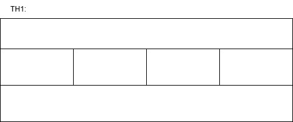
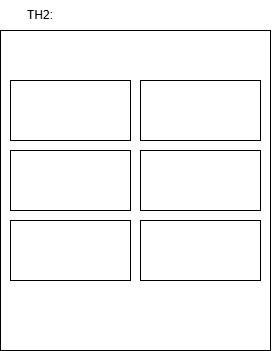
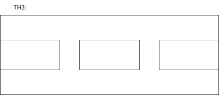
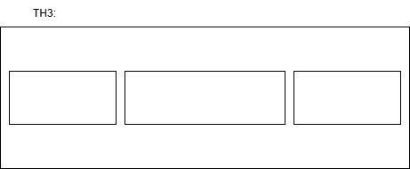
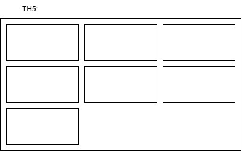

# PHIẾU BÀI TẬP 04 | CSS LAYOUT — Positioning, Flexbox & Grid
## PHẦN A — KIỂM TRA ĐỌC HIỂU (20 điểm)
### Câu A1 (10đ) — 5 Loại Positioning
| Position | Chiếm chỗ? | Mốc tọa độ | Use case |
|-----------|------------|-------------|-----------|
| `static` | Có | Không dùng `top/left` | Mặc định |
| `relative` | Có | Chính nó | Dịch nhẹ, làm mốc cho `absolute` |
| `absolute` | Không | Cha `relative` gần nhất | Badge, dropdown, tooltip |
| `fixed` | Không | Viewport | Chat button, modal overlay |
| `sticky` | Có => Không | Viewport *(khi dính)* | Sticky header, sidebar |

### Câu A2 (10đ) — Flexbox vs Grid
1. Trường hợp 1:

2. Trường hợp 2:

3. Trường hợp 3:

4. Trường hợp 4:

5. Trường hợp 5:


## PHẦN C — SUY LUẬN (20 điểm)
### Câu C1 (10đ) — Flexbox vs Grid: Khi nào dùng gì?
1. Nav bar ngang
```
-Dùng Flexbox. Do layout ngang, dùng display: flex, kết hợp justify-content: space-between
để căn chỉnh các thành phần (logo, buttons, menu).
```
2. Lưới ảnh Ins
```
-Dùng Grid. Do layout dạng lưới, có 3 cột, dùng grid và grid-template-columns: repeat(3, 1fr)
để căn chỉnh ảnh tự động, tự động xuống hàng, 3 cột đều nhau
```
3. Layout blog
```
 -Dùng Grid. Do layout 2 cột không đều nhau (main rộng hơn sidebar),
 dùng Grid với grid-template-columns: 2fr 1fr để chia tỷ lệ, dễ responsive (sidebar tự xuống dưới khi mobile).
```
4. Footer với 4 cột thông tin
```
-Dùng Flexbox hoặc Grid (cả 2 đều được).
-Flexbox: dùng flex: 1 cho mỗi cột, chiều rộng tự động dựa vào nội dung.
-Grid: dùng grid-template-columns: repeat(4, 1fr) nếu muốn 4 cột đều nhau chặt chẽ.
```
5. Card sản phẩm
```
-Dùng Flexbox. Do layout dọc, cần đẩy nút xuống đáy card, dùng display: flex với flex-direction: column,
cho phần text flex-grow: 1 để chiếm hết không gian, nút tự dính đáy bất kể text dài ngắn.
```
