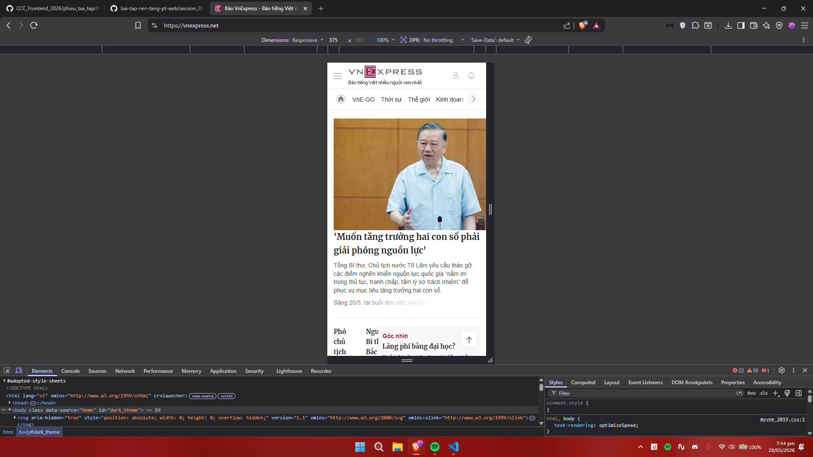
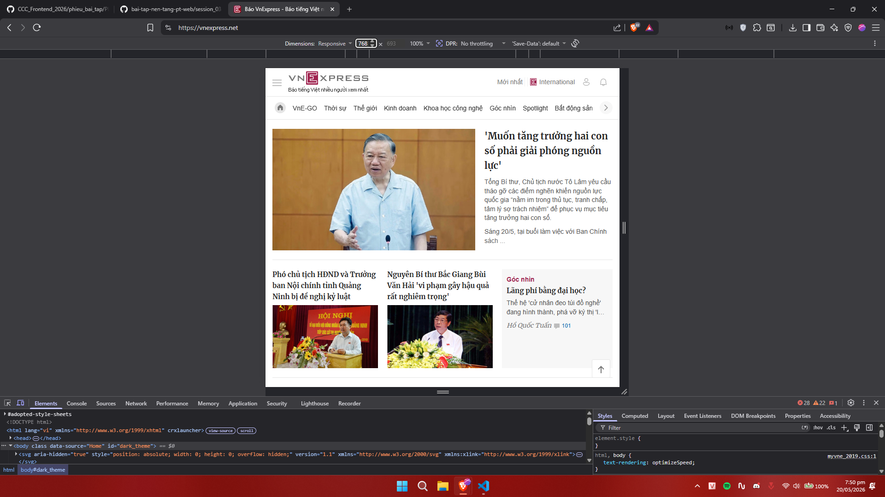
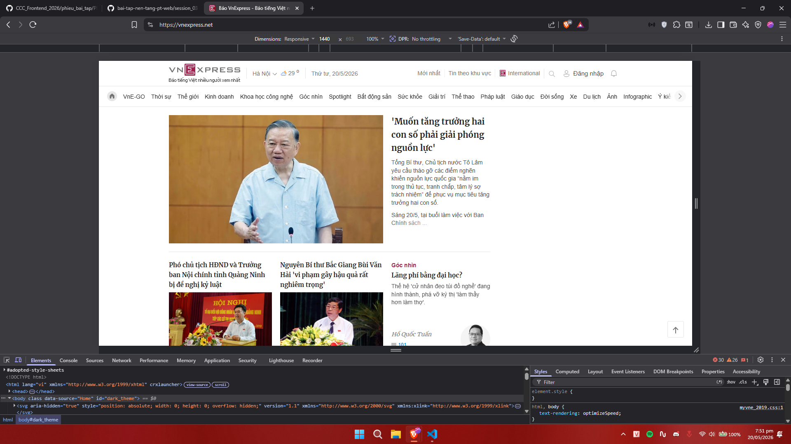
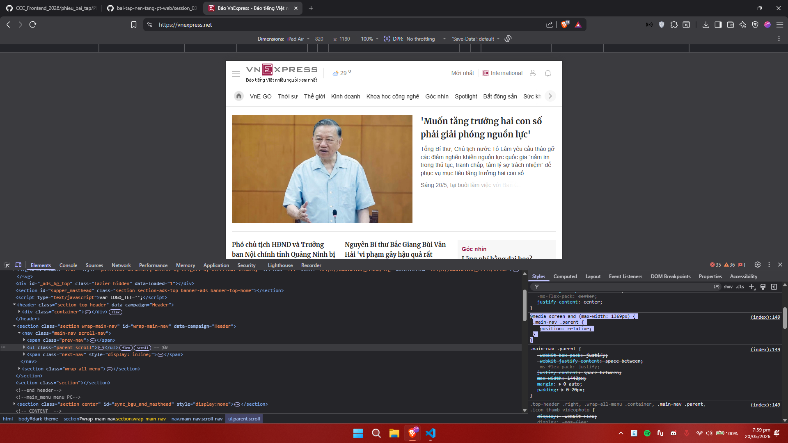
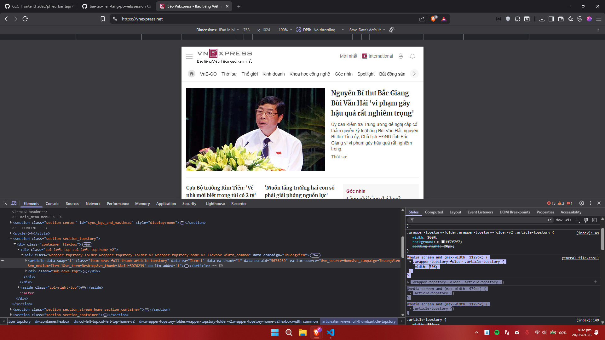

# PHIẾU BÀI TẬP 05 | CSS RESPONSIVE & SCSS — Responsive Design, Media Queries, Sass
## PHẦN A — KIỂM TRA ĐỌC HIỂU (20 điểm)
### Câu A1 (5đ) — Viewport & Mobile-First
1. Thẻ meta `meta-port`: `<meta name="viewport" content="width=device-width, initial-scale=1.0">`
```
- meta name: tên
- width=device-width: Cho trình duyệt biết chiều rộng trang = chiều rộng màn hình thiết bị (không phải zoom thu nhỏ)
- initial-scale=1.0: Mức zoom ban đầu = 100% (không phóng to/thu nhỏ)
```
2. Nếu thiếu thẻ này trên iPhone:
iPhone sẽ coi trang web là web desktop (980px), rồi thu nhỏ lại để vừa màn hình. Kết quả: chữ nhỏ xíu, phải zoom in mới đọc được, scroll ngang liên tục.

3.  Mobile-First vs Desktop-First:
```
/* Mobile-First (KHUYÊN DÙNG) */
.col { width: 100%; }                          /* Mặc định: mobile */
@media (min-width: 768px) { .col { width: 50%; } }  /* Tablet trở lên */

/* Desktop-First (cách cũ) */
.col { width: 50%; }                           /* Mặc định: desktop */
@media (max-width: 767px) { .col { width: 100%; } } /* Mobile trở xuống */
```
- Tại sao Mobile-First được khuyên dùng:  
+Điện thoại tải ít CSS hơn → nhanh hơn  
+Desktop thêm CSS = OK, điện thoại tải thừa CSS = lãng phí băng thông  
+60% traffic từ mobile, ưu tiên mobile trước là hợp lý

### Câu A2 (5đ) — Breakpoints
|Tên|Kích thước|Thiết bị|Ví Dụ|
|---|----------|--------|------|
|xs|<576px|Điện thoại dọc|1 cột|
|sm|>=576px|Điện thoại ngang|2 cột|
|md|>=768px|Tablet|2-3 cột|
|1g|>=992px|Desktop nhỏ|3-4 cột|
|xl|>=1200px|Desktop lớn|4-6 cột|

### Câu A3 (5đ) — Media Queries
|Chiều rộng màn hình|`.container` width|
|-|-|
|375px (iPhone SE)|100%|
|600px|540px|
|800px|720px|
|1000px|960px|
|1400px|1140px|

### Câu A4 (5đ) — SCSS Basics
1. Variables — Lưu giá trị tái sử dụng, sửa 1 chỗ = đổi toàn bộ:
```
$primary-color: #805ad5;
$spacing: 16px;

.button { 
    background: $primary-color; 
    padding: $spacing;
}

.header {
    background: $primary-color;
}
```
- Sửa màu chủ đạo chỉ cần đổi primary color

2. Nesting — Viết CSS theo cấu trúc HTML, dễ đọc hơn:
```
.navbar {
    background: #1a202c;
    padding: 16px;
    
    ul {
        list-style: none;
        
        li {
            margin-right: 24px;
            
            a {
                color: white;
                
                &:hover { color: $primary-color; }
            }
        }
    }
}
```
& = thẻ cha (ở đây là a). Không lồng quá 3 cấp để tránh selector quá dài.

3. Mixins — Hàm CSS dùng chung, truyền tham số được:
```
@mixin flex-center {
    display: flex;
    justify-content: center;
    align-items: center;
}

@mixin responsive($breakpoint) {
    @if $breakpoint == tablet {
        @media (min-width: 768px) { @content; }
    }
}

.hero { @include flex-center; }
.grid {
    @include responsive(tablet) {
        grid-template-columns: repeat(2, 1fr);
    }
}
```
4. Partials & Import — Chia file gọn gàng, compile thành 1 file CSS:
```
// _variables.scss (dấu _ = đừng compile riêng)
$primary-color: #805ad5;

// main.scss (file tổng hợp)
@import 'variables';
@import 'mixins';
@import 'components';
```
=> Compile ra 1 file main.css duy nhất.  

- Tại sao trình duyệt không đọc được .scss:  
  + Trình duyệt chỉ hiểu CSS thuần, không hiểu cú pháp SCSS (variables $, nesting, mixins @mixin/@include). Cần compile SCSS => CSS bằng:

    + VS Code: Extension "Live Sass Compiler" => Click "Watch Sass"  
    + Command line: sass scss/style.scss style.css  
    + Dự án thực tế: Webpack/Vite tự động xử lý (React/Vue đã tích hợp sẵn)

## PHẦN C — PHÂN TÍCH (20 điểm)
### Câu C1 (10đ) — Phân tích trang web thực
VNEXPRESS:  
- Mobile (375px)

- Tablet (768px)

- Desktop (1440px)

1. Navigation thay đổi thế nào?
```
Desktop (1440px): Thanh menu ngang hiển thị đầy đủ tất cả các chuyên mục và liên kết phụ.

Tablet (768px) & Mobile (375px): Thanh menu bị ẩn. Xuất hiện Hamburger menu (biểu tượng 3 dấu gạch ngang) ở góc trái trên cùng để chứa các danh mục bị ẩn. Thanh chuyên mục bên dưới chuyển thành dạng cuộn ngang.
```

2. Lưới content thay đổi mấy cột?
```
Desktop: Lưới hiển thị nhiều cột (phía dưới bài viết chính là lưới 3 cột cho 3 bài viết phụ).

Tablet: Vẫn giữ lưới 3 cột nhưng khoảng cách và chiều ngang các cột bị thu hẹp lại.

Mobile: Lưới content bẻ hoàn toàn thành 1 cột duy nhất. Các bài viết xếp chồng lên nhau.
```
3. Elements nào bị ẩn trên mobile?
```
Thông tin thời tiết (Hà Nội 29 độ), thứ/ngày/tháng ở trên cùng.

Các liên kết phụ trên header như: "Mới nhất", "Tin theo khu vực", "International".

Biểu tượng kính lúp tìm kiếm và nút "Đăng nhập" (những phần này được đẩy vào trong Hamburger menu).
```
4. Font size có thay đổi không?
```
Có. Kích thước font chữ của tiêu đề bài viết trên Mobile nhỏ hơn so với Desktop và Tablet. Việc này giúp tiêu đề không bị rớt thành quá nhiều dòng, tiết kiệm không gian trên màn hình điện thoại hẹp.
```
- 2 ảnh media:
  
  
### 