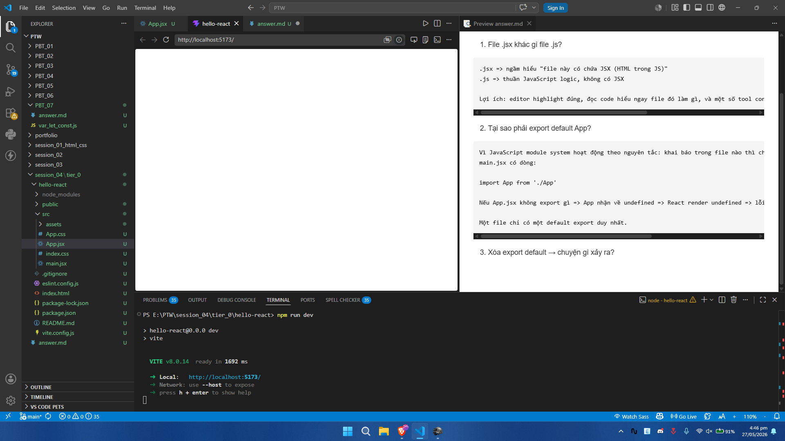

# 📝 Bài 0.1 — Chạy React đầu tiên (5 phút)
1. File .jsx khác gì file .js?

```
.jsx => ngầm hiểu "file này có chứa JSX (HTML trong JS)"
.js => thuần JavaScript logic, không có JSX

Lợi ích: editor highlight đúng, đọc code hiểu ngay file đó làm gì, và một số tool config dựa vào extension để quyết định có parse JSX không.
```

2. Tại sao phải export default App?
```
Vì JavaScript module system hoạt động theo nguyên tắc: khai báo trong file nào thì chỉ sống trong file đó, trừ khi được export ra ngoài.
main.jsx có dòng:

import App from './App'

Nếu App.jsx không export gì => App nhận về undefined => React render undefined => lỗi.

Một file chỉ có một default export duy nhất.
```

3. Xóa export default → chuyện gì xảy ra?
- Không hiện thị nội dung:
